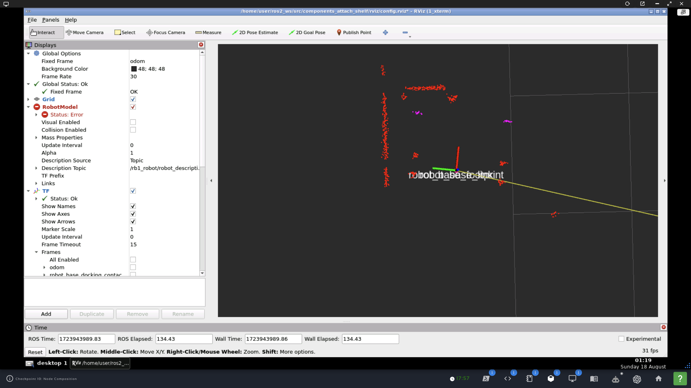

### `components_attach_shelf`

This was supposed to be a branch of `attach_shelf` under a `checkpoint9`->[multiple packages] structure. Instead, it is a standalone package repository. See [Submission Notes](#submission-notes) for copy-paste launch instructions.  

This is a rework of [attach_shelf](https://github.com/ivogeorg/attach_shelf.git) into ROS2 components. The requirements are in [checkpoint-10](assets/checkpoint-10.pdf).

#### Submission notes

1. Launching Task 1:
   1. Launching a component manager (container):
      ```
      ros2 run rclcpp_components component_container
      ```
   2. Loading runtime component (which is a dynamically loaded library):
      ```
      cd ~/ros2_ws/src
      git clone https://github.com/ivogeorg/components_attach_shelf.git
      git checkout checkpoint-10-all
      cd ~/ros2_ws
      colcon build
      source install/setup.bash
      ros2 component load /ComponentManager components_attach_shelf my_components::PreApproach
      ```
2. Launching Task 2:
   1. Manually composed nodes:
      ```
      cd ~/ros2_ws/src
      git clone https://github.com/ivogeorg/components_attach_shelf.git
      git checkout checkpoint-10-all
      cd ~/ros2_ws
      colcon build
      source install/setup.bash
      ros2 launch components_attach_shelf attach_to_shelf
      ```
   2. Loading runtime component:
      ```
      source ~/ros2_ws/install/setup.bash
      ros2 component load /my_container components_attach_shelf my_components::AttachClient
      ```
3. Notes: 
   1. Task 1 is a case of runtime composition. A component is loaded into an already running container.
   2. Task 2 contains both compile-time (aka manual) and runtime composition.
   3. The parameters for the pre-approach are **0.45 m** and **-90.0** degrees. This is the perfect position for the final approach. 
   4. To avoid significant rewriting of the code for `AttachServer`, the executable for the `ComposableNodeContainer` in the [launch file](launch/attach_to_shelf.launch.py) was changed to `component_container_mt`. Thus `my_container` runs a multi-threaded executor instead of the default single-threaded.
   5. `cart_frame` is only broadcast until the robot reaches it!
4. Expected result (of Task 2):
   1. Command line:
      ```
      user:~$ ros2 component list
      /my_container
        1  /pre_approach
        2  /attach_server
        3  /attach_client
        ```
   2. Visual:
      | Gazebo | Rviz2 |
      | --- | --- |
      |  |  |
   3. `stdout`
      ```
      user:~/ros2_ws$ ros2 launch components_attach_shelf attach_to_shelf.launch.py
      [INFO] [launch]: All log files can be found below /home/user/.ros/log/2024-08-18-01-49-06-555540-1_xterm-13563
      [INFO] [launch]: Default logging verbosity is set to INFO
      [INFO] [component_container_mt-1]: process started with pid [13576]
      [component_container_mt-1] [INFO] [1723945746.980525428] [my_container]: Load Library: /home/user/ros2_ws/install/components_attach_shelf/lib/libpre_approach.so
      [component_container_mt-1] [INFO] [1723945746.984546249] [my_container]: Found class: rclcpp_components::NodeFactoryTemplate<my_components::PreApproach>
      [component_container_mt-1] [INFO] [1723945746.984589685] [my_container]: Instantiate class: rclcpp_components::NodeFactoryTemplate<my_components::PreApproach>
      [component_container_mt-1] [INFO] [1723945747.005495293] [pre_approach]: Successfully set logger level 'INFO' for pre_approach.
      [component_container_mt-1] [INFO] [1723945748.937701768] [pre_approach]: 'scan' topic publisher acquired
      [INFO] [launch_ros.actions.load_composable_nodes]: Loaded node '/pre_approach' in container '/my_container'
      [component_container_mt-1] [INFO] [1723945748.937769090] [pre_approach]: 'odom' topic publisher acquired
      [component_container_mt-1] [INFO] [1723945748.938100603] [pre_approach]: Waiting for data
      [component_container_mt-1] [INFO] [1723945748.942800452] [my_container]: Load Library: /home/user/ros2_ws/install/components_attach_shelf/lib/libattach_server.so
      [component_container_mt-1] [INFO] [1723945748.946837455] [my_container]: Found class: rclcpp_components::NodeFactoryTemplate<my_components::AttachServer>
      [component_container_mt-1] [INFO] [1723945748.946876768] [my_container]: Instantiate class: rclcpp_components::NodeFactoryTemplate<my_components::AttachServer>
      [component_container_mt-1] [INFO] [1723945748.976487618] [attach_server]: Successfully set logger level 'INFO' for attach_server.
      [component_container_mt-1] [INFO] [1723945748.976538643] [attach_server]: Server of /approach_shelf service started
      [INFO] [launch_ros.actions.load_composable_nodes]: Loaded node '/attach_server' in container '/my_container'
      [component_container_mt-1] [INFO] [1723945748.998621081] [pre_approach]: Waiting for data
      [component_container_mt-1] [INFO] [1723945749.098710787] [pre_approach]: Waiting for laser scanner to be parametrized
      [component_container_mt-1] [INFO] [1723945749.098785525] [pre_approach]: Laser scanner parametrized
      [component_container_mt-1] [INFO] [1723945767.198644908] [pre_approach]: Pre-approach completed
      [component_container_mt-1] [INFO] [1723945777.486186831] [my_container]: Load Library: /home/user/ros2_ws/install/components_attach_shelf/lib/libattach_client.so
      [component_container_mt-1] [INFO] [1723945777.486819274] [my_container]: Found class: rclcpp_components::NodeFactoryTemplate<my_components::AttachClient>
      [component_container_mt-1] [INFO] [1723945777.486866951] [my_container]: Instantiate class: rclcpp_components::NodeFactoryTemplate<my_components::AttachClient>
      [component_container_mt-1] [INFO] [1723945777.508703983] [attach_client]: '/approach_shelf' service client loaded
      [component_container_mt-1] [INFO] [1723945777.509452665] [attach_client]: Client sending request to service
      [component_container_mt-1] [INFO] [1723945777.509571396] [attach_server]: Recived request with attach_to_service='true'
      [component_container_mt-1] [INFO] [1723945777.509902459] [attach_server]: `cart_frame` TF from `robot_front_laser_base_link`: x=0.793280, y=-0.042965, yaw=0.054108
      [component_container_mt-1] [INFO] [1723945777.509994888] [attach_server]: TF required `odom`->`robot_front_laser_base_link`
      [component_container_mt-1] [INFO] [1723945777.575009948] [attach_server]: Acquired TF `odom`->`robot_front_laser_base_link`
      [component_container_mt-1] [INFO] [1723945777.575669590] [attach_server]: Broadasting `cart_frame`
      [component_container_mt-1] [INFO] [1723945777.575701665] [attach_server]: Correcting for laser link
      [component_container_mt-1] [INFO] [1723945778.732263005] [attach_server]: Facing shelf (incl. drift correction)
      [component_container_mt-1] [INFO] [1723945780.793101513] [attach_server]: Approaching shelf
      [component_container_mt-1] [INFO] [1723945783.680844560] [attach_server]: Straightening out
      [component_container_mt-1] [INFO] [1723945784.245321919] [attach_server]: Moving under shelf
      [component_container_mt-1] [INFO] [1723945786.240759530] [attach_server]: Attaching to shelf
      [component_container_mt-1] [INFO] [1723945786.241936650] [attach_server]: Final approach completed
      [component_container_mt-1] [INFO] [1723945786.243235169] [attach_client]: Final approach complete: 'true'
      ```

#### Implementation notes

1. The original multi-callback [`approach_service_server.cpp`](https://github.com/ivogeorg/attach_shelf/blob/main/src/approach_service_server.cpp) does not work as a monolithic component. Have to understand how multi-callback nodes work as components. _It's not impossible that the monolithic node has to be broken down into other nodes, though I can't see how - the server node still has to subscribe to all the topics it needs and listen to the tranforms it needs._
   1. Before dynamically loading the `my_components::AttachClient` component, all callbacks of `my_components::AttachServer` work fine.
   2. The moment the client component is loaded, the `listener_cb` seizes to be called:
      ```
      [component_container-1] [DEBUG] [1723932076.040635383] [attach_server]: LISTEN
      [component_container-1] [DEBUG] [1723932076.140632904] [attach_server]: LISTEN
      [component_container-1] [DEBUG] [1723932076.240625171] [attach_server]: LISTEN
      [component_container-1] [DEBUG] [1723932076.340666299] [attach_server]: LISTEN
      [component_container-1] [DEBUG] [1723932076.440651536] [attach_server]: LISTEN
      [component_container-1] [DEBUG] [1723932076.540658714] [attach_server]: LISTEN
      [component_container-1] [DEBUG] [1723932076.640602438] [attach_server]: LISTEN
      [component_container-1] [DEBUG] [1723932076.740645391] [attach_server]: LISTEN
      [component_container-1] [DEBUG] [1723932076.841060434] [attach_server]: LISTEN
      [component_container-1] [DEBUG] [1723932076.940677898] [attach_server]: LISTEN
      [component_container-1] [INFO] [1723932077.037262090] [my_container]: Load Library: /home/user/ros2_ws/install/components_attach_shelf/lib/libattach_client.so
      [component_container-1] [INFO] [1723932077.037834904] [my_container]: Found class: rclcpp_components::NodeFactoryTemplate<my_components::AttachClient>
      [component_container-1] [INFO] [1723932077.037873024] [my_container]: Instantiate class: rclcpp_components::NodeFactoryTemplate<my_components::AttachClient>
      [component_container-1] [INFO] [1723932077.045705232] [attach_client]: '/approach_shelf' service client loaded
      [component_container-1] [INFO] [1723932077.046331261] [attach_client]: Client sending request to service
      [component_container-1] [DEBUG] [1723932077.047573182] [attach_server]: LISTEN
      [component_container-1] [INFO] [1723932077.048000273] [attach_server]: Recived request with attach_to_service='true'
      [component_container-1] [DEBUG] [1723932077.048289889] [attach_server]: Segmented reflective points into 2 sets
      [component_container-1] [DEBUG] [1723932077.048398120] [attach_server]: left_ix = 427, right_ix = 625
      [component_container-1] [DEBUG] [1723932077.048418108] [attach_server]: left_range = 0.823750, right_range = 0.837939, angle = 0.863940
      [component_container-1] [INFO] [1723932077.048499338] [attach_server]: `cart_frame` TF from `robot_front_laser_base_link`: x=0.754341, y=0.016943, yaw=-0.022457
      [component_container-1] [INFO] [1723932077.048596535] [attach_server]: TF required `odom`->`robot_front_laser_base_link`
      [component_container-1] [DEBUG] [1723932077.048610021] [attach_server]: listen_to_odom_laser_='true'
      [component_container-1] [DEBUG] [1723932077.048620763] [attach_server]: Waiting for listener...
      ```  
   3. As expected, all callbacks seize to be called.  
      ```
      [component_container-1] [DEBUG] [1723932507.145720844] [attach_server]: SCAN @ [278:860000000]
      [component_container-1] [DEBUG] [1723932507.170331743] [attach_server]: ODOM @ [5.610630:0.037836]
      [component_container-1] [DEBUG] [1723932507.179430743] [attach_server]: LISTEN
      [component_container-1] [DEBUG] [1723932507.180747485] [attach_server]: BROADCAST
      [component_container-1] [DEBUG] [1723932507.195427800] [attach_server]: SCAN @ [278:911000000]
      [component_container-1] [DEBUG] [1723932507.251709055] [attach_server]: SCAN @ [278:960000000]
      [component_container-1] [DEBUG] [1723932507.278808767] [attach_server]: ODOM @ [5.610630:0.037842]
      [component_container-1] [DEBUG] [1723932507.280436070] [attach_server]: LISTEN
      [component_container-1] [DEBUG] [1723932507.280764285] [attach_server]: BROADCAST
      [component_container-1] [INFO] [1723932507.292585378] [my_container]: Load Library: /home/user/ros2_ws/install/components_attach_shelf/lib/libattach_client.so
      [component_container-1] [INFO] [1723932507.293212755] [my_container]: Found class: rclcpp_components::NodeFactoryTemplate<my_components::AttachClient>
      [component_container-1] [INFO] [1723932507.293274412] [my_container]: Instantiate class: rclcpp_components::NodeFactoryTemplate<my_components::AttachClient>
      [component_container-1] [INFO] [1723932507.306967089] [attach_client]: '/approach_shelf' service client loaded
      [component_container-1] [INFO] [1723932507.307510107] [attach_client]: Client sending request to service
      [component_container-1] [INFO] [1723932507.308088080] [attach_server]: Recived request with attach_to_service='true'
      [component_container-1] [DEBUG] [1723932507.309653359] [attach_server]: Segmented reflective points into 2 sets
      [component_container-1] [DEBUG] [1723932507.309952604] [attach_server]: left_ix = 424, right_ix = 616
      [component_container-1] [DEBUG] [1723932507.309975496] [attach_server]: left_range = 0.882085, right_range = 0.844292, angle = 0.837760
      [component_container-1] [INFO] [1723932507.310020526] [attach_server]: `cart_frame` TF from `robot_front_laser_base_link`: x=0.787233, y=-0.046402, yaw=0.058876
      [component_container-1] [INFO] [1723932507.310113341] [attach_server]: TF required `odom`->`robot_front_laser_base_link`
      [component_container-1] [DEBUG] [1723932507.310147205] [attach_server]: listen_to_odom_laser_='true'
      [component_container-1] [DEBUG] [1723932507.310161612] [attach_server]: Waiting for listener...
      ```
   4. The same thing happens if the three components (`PreApproach`, `AttachServer` and `AttachClient`) are dynamically loaded into the `/ComponentManager`.
   5. Caused by the code in `attach_server.cpp` which hangs and hangs the whole container.
      1. Here is the log showing the problem (the current thread is not being preempted):
         ```
         [INFO] [1723939612.676604808] [approach_server]: `cart_frame` TF from `robot_front_laser_base_link`: x=0.779906, y=-0.007330, yaw=0.009398
         [INFO] [1723939612.676684457] [approach_server]: TF required `odom`->`robot_front_laser_base_link`
         [DEBUG] [1723939612.676705110] [approach_server]: listen_to_odom_laser_='true'
         [DEBUG] [1723939612.676727559] [approach_server]: Waiting for listener...
         [ERROR] [1723939627.676856540] [approach_server]: Did not get TF 'odom_laser_t_
         [DEBUG] [1723939627.676943349] [approach_server]: odom_laser_t_.header.stamp=0 sec
         [DEBUG] [1723939627.676966344] [approach_server]: odom_laser_t_.header.frame_id=''
         [DEBUG] [1723939627.676984565] [approach_server]: odom_laser_t_.child_frame_id=''
         [DEBUG] [1723939627.677245307] [approach_server]: LISTEN
         [DEBUG] [1723939627.677272937] [approach_server]: Listening for `odom`->`robot_front_laser_base_link`
         [DEBUG] [1723939627.677313109] [approach_server]: lookupTransoform returned:
         [DEBUG] [1723939627.677326075] [approach_server]: odom_laser_t_.header.stamp=1884 sec
         [DEBUG] [1723939627.677338969] [approach_server]: odom_laser_t_.header.frame_id='odom'
         [DEBUG] [1723939627.677354265] [approach_server]: odom_laser_t_.child_frame_id='robot_front_laser_base_link'
         [DEBUG] [1723939627.677374151] [approach_server]: BROADCAST
         ```
       2. This is likely caused by the sequential execution of the callbacks in the default `SingleThreadedExecutor` of the component container.
       3. This might be remediable with the following option (but not in Humble):
          ```
          RCLCPP_COMPONENTS_REGISTER_NODE(
              my_components::AttachServer,
              rclcpp::executors::MultiThreadedExecutor::make_shared())
          ```
       4. There is a different option for Humble suggested in the tutorial [Writing A Composable Node](https://docs.ros.org/en/humble/Tutorials/Intermediate/Writing-a-Composable-Node.html). In `ComposableNodeContainer`:
          ```
          executable='component_container_mt'
          ```
2. _How is the `NodeOptions` parameter of component classes specified?_
3. Problem with loading and unloading `my_components::AttachClient` to `/my_container`:
   ```
   user:~$ ros2 component load /my_container components_attach_shelf
   --extra-argument             --node-namespace             --spin-time                  -p                           my_components::AttachClient
   --log-level                  --parameter                  --use-sim-time               -q                           my_components::AttachServer
   --no-daemon                  --quiet                      -e                           -r                           my_components::PreApproach
   --node-name                  --remap-rule                 -n                           -s
   user:~$ ros2 component load /my_container components_attach_shelf my_components::AttachClient
   Loaded component 3 into '/my_container' container node as '/attach_client'
   user:~$ ros2 component list
   /my_container
   No 'list_nodes' service response when listing components
   user:~$ ros2 component list
   /my_container
   No 'list_nodes' service response when listing components
   user:~$ ros2 component unload
   --no-daemon     --quiet         --spin-time     --use-sim-time  -q              -s              /my_container
   user:~$ ros2 component unload /my_container 3
   ```
   1. Before loading the `my_components::AttachClient` component, the component listing command worked fine:
      ```
      user:~$ ros2 component list
      /my_container
        1  /pre_approach
        2  /attach_server
      ```
   2. After loading, it throws an error (same question [here](https://answers.ros.org/question/411252/no-list_nodes-service-found-when-listing-components/) when following the [tutorial](https://docs.ros.org/en/humble/Tutorials/Intermediate/Composition.html) but no answers):
      ```
      user:~$ ros2 component list
      /my_container
      No 'list_nodes' service response when listing components
      ```
   3. The unloading command hangs:
      ```
      user:~$ ros2 component unload /my_container 3
      ```
   4. Btw, this is where the container name `/my_container` comes from:
      ```
      cmd '/opt/ros/humble/lib/rclcpp_components/component_container --ros-args -r __node:=my_container -r __ns:=/'
      ```
      which is specified in the [launch file](launch/attach_to_shelf.launch.py):
      ```
      def generate_launch_description():
          """Generate launch description with multiple components."""
          container = ComposableNodeContainer(
              name='my_container',
              namespace='',
              package='rclcpp_components',
              executable='component_container',
              ...)
      ```
   5. When a separate the component is loaded into a separate container, the list error only appears for `/my_container`:
      ```
      user:~$ ros2 component list
      /my_container
        1  /pre_approach
        2  /attach_server
      /ComponentManager
      user:~$ ros2 component load /ComponentManager components_attach_shelf my_components::AttachClient
      Loaded component 1 into '/ComponentManager' container node as '/attach_client'
      user:~$ ros2 component list
      /my_container
      No 'list_nodes' service response when listing components
      /ComponentManager
        1  /attach_client
      ```
   6. Unload works from the separate container:
      ```
      user:~$ ros2 component unload /ComponentManager 1
      Unloaded component 1 from '/ComponentManager' container node
      ```
   7. Unloading from `/my_container` stil hangs and listing error persists:
      ```
      user:~$ ros2 component unload /ComponentManager 1
      Unloaded component 1 from '/ComponentManager' container node
      user:~$ ros2 component unload /my_container 1
      ^C!rclpy.ok()
      user:~$ ros2 component list
      /my_container
      No 'list_nodes' service response when listing components
      /ComponentManager
      ```
4. The composition approach requirements in [checkpoint-10](assets/checkpoint-10.pdf) now make sense:
   1. The composition of `PreApproach` and `AttachServer` is **manual** as the container and composable nodes are specified in the [launch file](launch/attach_to_shelf.launch.py).
   2. The "composition" of `AttachClient` is **runtime** because it is loaded at run time in a running container.
